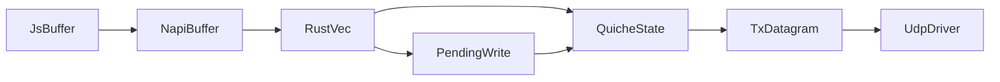

# Native Write Lease Research

## Scope

This memo captures the repo-specific investigation for a native-owned outbound
write lease system for:

- raw QUIC stream writes
- HTTP/3 request and response body DATA writes

It is intentionally focused on research and architecture mapping, not on code
changes.

## Main Findings

1. The current hot outbound path is `JS Buffer -> napi Buffer -> Rust Vec<u8> -> PendingWrite -> quiche`.
2. The binding layer always copies outbound payload bytes with `data.to_vec()`.
3. JS stream wrappers do not receive true native partial-write results today; `lib/event-loop.ts` synthesizes full logical success with `Math.max(data.length, fin ? 1 : 0)`.
4. `EVENT_DRAIN` currently means "the stream is writable again at the quiche/flow-control layer" and is already the best existing signal to align with chunk-pool exhaustion.
5. The existing `src/buffer_pool.rs` is only for encrypted UDP packet buffers, not for stream payload ownership.
6. At the current quiche API boundary, the earliest reclaim point visible in this repo is "quiche accepted the bytes", not UDP send completion. If the same chunk must remain authoritative through retransmission, that likely requires a deeper integration layer than the current `&[u8]` send APIs expose.

## Current Outbound Code Map

### JS and TS path

- `lib/quic-stream.ts`
  - `QuicStream._write()`
  - `QuicStream._writeChunk()`
  - `QuicStream._final()`
  - `QuicStream._onNativeDrain()`
- `lib/stream.ts`
  - `ServerHttp3Stream.respond()`
  - `ServerHttp3Stream._write()`
  - `ServerHttp3Stream._writeChunk()`
  - `ServerHttp3Stream._final()`
  - `ClientHttp3Stream._write()`
  - `ClientHttp3Stream._writeChunk()`
  - `ClientHttp3Stream._final()`
- `lib/event-loop.ts`
  - `WorkerEventLoop.streamSend()`
  - `ClientEventLoop.streamSend()`
- `lib/client.ts`
  - `Http3ClientSession.request()`
  - `Http3ClientSession._dispatchEvents()`
  - `Http3ClientSession._onDrain()`
- `lib/server.ts`
  - server `_dispatchEvents()`
  - server `_onDrain()`
- `lib/quic-client.ts`
  - `QuicClientSession._dispatchEvents()`
  - `QuicClientSession._onDrain()`
- `lib/quic-server.ts`
  - server `_dispatchEvents()`
  - server `_onDrain()`
- adapter and framing helpers
  - `lib/fetch-adapter.ts`
  - `lib/sse.ts`
  - `lib/express-adapter.ts`
  - datagram helpers in `lib/session.ts`, `lib/quic-client.ts`, and `lib/quic-server.ts`

### Native binding path

- `src/client.rs`
  - `NativeWorkerClient::stream_send()`
- `src/server.rs`
  - `NativeWorkerServer::stream_send()`
- `src/quic_client.rs`
  - `NativeQuicClient::stream_send()`
- `src/quic_server.rs`
  - `NativeQuicServer::stream_send()`
- `index.d.ts`
  - declares native `streamSend(...): boolean`
- `src/event_loop.rs`
  - `ThreadsafeFunction` event delivery back to JS

### Rust transport path

- `src/worker.rs`
  - `H3ServerHandler`
  - `H3ClientHandler`
  - `PendingWrite`
  - `flush_pending_writes()`
  - `flush_client_pending_writes()`
- `src/quic_worker.rs`
  - `QuicServerHandler`
  - `QuicClientHandler`
  - `PendingWrite`
  - `flush_quic_pending_writes()`
  - `flush_quic_client_pending_writes()`
- `src/connection.rs`
  - `H3Connection::send_body()`
  - `H3Connection::poll_drain_events()`
  - `H3Connection::stream_close()`
- `src/quic_connection.rs`
  - `QuicConnection::stream_send()`
  - `QuicConnection::poll_drain_events()`
  - `QuicConnection::stream_close()`
- `src/event_loop.rs`
  - main runtime ordering
- `src/buffer_pool.rs`
  - UDP TX packet pool
- `src/transport/mod.rs`
  - `TxDatagram`
  - `Driver::submit_sends()`
  - `Driver::drain_recycled_tx()`

## Current Data Ownership Path

Observed ownership transitions:

- JS creates or passes a `Buffer`.
- napi-rs receives a `Buffer` and immediately copies to `Vec<u8>` with `to_vec()`.
- The worker either:
  - sends `&data` straight into quiche, or
  - stores the unsent tail in `PendingWrite.data`.
- After quiche produces packet bytes, those bytes go into a pooled `TxDatagram` buffer and later recycle through `drain_recycled_tx()`.

The stream payload and the packet buffer are separate lifetime domains.

## Current Allocation and Copy Hotspots

### JS materialization sites on outbound paths

- `lib/quic-stream.ts`
  - `Buffer.alloc(0)` for FIN-only `_final()`
  - `chunk.subarray(written)` for drain retry
- `lib/stream.ts`
  - same `Buffer.alloc(0)` and `subarray()` patterns in both H3 stream classes
- `lib/fetch-adapter.ts`
  - `Buffer.from(value)` while forwarding streamed bodies
  - `Buffer.concat(chunks)` while collecting HTTP/1 request bodies
- `lib/sse.ts`
  - SSE frames are built as strings, then encoded through stream writes
- datagram helpers
  - `Buffer.from(data)` before `sendDatagram()`

### Native copies and retention

- binding edge
  - `data.to_vec()` in `src/client.rs`, `src/server.rs`, `src/quic_client.rs`, `src/quic_server.rs`
- first blocked tail
  - `data[written..].to_vec()` in `src/worker.rs` and `src/quic_worker.rs`
- blocked append path
  - `PendingWrite.data.extend_from_slice(&data)`
- retry path
  - `pw.data.drain(..written)` as chunks are progressively accepted

## Calling Pattern Analysis

### `_writev`

- No `_writev` implementation exists in the repo.
- No `_writev` match was found across `*.ts`, `*.js`, or `*.rs`.
- Any coalescing for this project will need to live inside stream internals or a dedicated private writer layer, not in a current `Writable._writev` override.

### Observed write shapes in repo tests

From the TypeScript test corpus:

- about `13` direct `stream.write(...)` sites
- about `9` explicit `stream.end()` no-payload sites
- about `6` `stream.end(Buffer.concat(chunks))` aggregation sites

Concrete examples:

- repeated writes:
  - `test/interop/quic-protocol.test.ts`
  - `test/core/worker-traffic.test.ts`
  - `test/core/worker-edge-cases.test.ts`
- zero-byte FIN:
  - `test/interop/quic-edge-cases.test.ts`
  - `test/core/worker-traffic.test.ts`
  - `test/core/unified-dual-stack.test.ts`
- aggregation into one final body:
  - `test/interop/quic-race-conditions.test.ts`
  - `test/core/worker-traffic.test.ts`
  - `test/runtime/h3-fast-shared-worker.test.ts`

### Observed payload sizes

Benchmark presets already cluster around:

- `1 KiB` in `smoke`
- `4 KiB` in `balanced`
- `16 KiB` in `throughput`
- `16 KiB` in `stress`

Pressure and regression tests cover:

- `512 B`
- `1 KiB`
- `2 KiB`
- `4 KiB`
- `8 KiB`
- `16 KiB`
- `32 KiB`
- `64 KiB`
- `128 KiB`
- `256 KiB`
- `1 MiB`
- `2 MiB`

Interpretation:

- `1-4 KiB` is the strongest existing evidence for the dominant critical-path class.
- `16 KiB` matters for throughput lanes.
- `64 KiB+` appears mostly in backpressure, stress, and correctness tests rather than as the primary everyday hot-path target.

### Header/body assembly behavior

HTTP/3 headers and DATA are already separated:

- request headers use `sendRequest(...)` in `lib/client.ts`
- response headers use `sendResponseHeaders(...)` in `lib/stream.ts`
- body bytes use `streamSend(...)`

This repo does not currently build a large combined "headers plus body" outbound
buffer for H3 body writes. That is favorable for a lease design: the request
header path can stay separate while the DATA path migrates.

### DATAGRAM relevance

DATAGRAM paths are relevant to allocation hygiene but are not the main lease
target:

- they still materialize `Buffer.from(data)`
- they do not share the stream-body drain model
- they do not currently justify being in the first lease rollout

## Drain and Backpressure Semantics

### What `EVENT_DRAIN` means today

Current native behavior:

1. `H3Connection::send_body()` or `QuicConnection::stream_send()` detects a short write or `Done`.
2. The stream is inserted into `blocked_set` and `blocked_queue`.
3. `run_event_loop()` later calls:
   - `handler.poll_drain_events(...)`
   - `handler.flush_pending_writes(...)`
4. `stream_writable(stream_id, 1)` decides whether the stream is writable again.
5. The worker emits `JsH3Event::drain(...)`.
6. JS dispatchers route it to `stream._onNativeDrain()`.
7. Pending `_drainCallbacks` retry work from the stream wrappers.

Important nuance:

- public Node `'drain'` behavior is still largely governed by `Writable`
  buffering because JS adapters currently pretend the native layer accepted the
  full payload immediately
- `EVENT_DRAIN` is a native writability signal, but the byte-count contract is
  not faithfully surfaced to JS yet

### Can chunk exhaustion map to current drain semantics?

Yes, probably.

The cleanest alignment is:

- if no chunk is available, fail fast internally instead of blocking
- mark the stream as pool-starved
- emit the existing `EVENT_DRAIN` when the stream becomes writable again for
  either transport-credit or pool-capacity reasons

Recommendation:

- keep one public `EVENT_DRAIN`
- preserve internal cause categories for diagnostics:
  - flow-control blocked
  - pending-write backlog
  - chunk-pool exhausted
  - invalidated before retry

## Native Send-Lifetime Boundary

### Earliest reclaim boundary visible in this repo

At the current API boundary, the earliest reclaim point for a future native
chunk is:

- after `send_body()` or `stream_send()` fully accepts the payload, or
- after the final blocked tail leaves `PendingWrite`

Why:

- the worker passes `&[u8]` into quiche
- if quiche fully accepts the payload, the worker drops the caller-owned `Vec<u8>`
- the code does not preserve caller-owned storage until UDP send completion

That means the current design already assumes repo-local payload memory is no
longer needed after quiche acceptance.

### Important constraint

If the same native chunk must remain authoritative through retransmission,
congestion retention, and final transport completion, the present `quiche`
integration looks too high-level:

- `quiche::Connection::stream_send(...)` and `quiche::h3::Connection::send_body(...)`
  only take borrowed slices
- this repo has no visible hook showing quiche can retain caller-owned memory
  without copying or internalizing it

Research conclusion:

- a native chunk pool can remove JS heap ownership and Rust allocator churn at
  the current layer
- but "the exact same chunk survives until transport completion" is not proven
  achievable without a lower-level or quiche-side integration strategy

### Packet-lifetime buffers are already separate

`src/buffer_pool.rs` and `Driver::drain_recycled_tx()` already support recycling
packet buffers after the driver finishes sending them. That pool is downstream
of quiche packetization and should remain separate from any stream-payload
chunk pool.

## Lease Invalidation Boundaries

### What happens today

- `stream.close()` in `lib/quic-stream.ts` and `lib/stream.ts`
  - calls native `streamClose(...)`
  - flushes `_drainCallbacks`
  - destroys the JS stream
- session close in `lib/client.ts`, `lib/server.ts`, `lib/quic-client.ts`,
  and `lib/quic-server.ts`
  - destroys or cleans up streams
  - tears down session state
- native `stream_close(...)`
  - removes blocked-stream bookkeeping
- native `cleanup_closed(...)`
  - drops `pending_writes` for closed connections
- client worker `is_reapable()`
  - waits for `session_closed_emitted && pending_writes.is_empty()`

### What is missing for a lease system

There is no explicit registry of "open JS-exposed write leases" today.

That future registry must invalidate leases on:

- stream reset before commit
- stream close before commit
- session close before commit
- runtime shutdown
- connection cleanup in `cleanup_closed(...)`

Future `commit()` and `abort()` must then fail deterministically after
invalidation.

## Callback-Scoped Fill vs Lease Object

### Best callback-scoped fill candidates

These paths are tightly controlled and naturally synchronous:

- `lib/fetch-adapter.ts`
  - response-body forwarding loop
- `lib/sse.ts`
  - frame encoding
- any future internal coalescer that batches repeated small writes before a send

Why they fit:

- the encoder already owns the bytes just before dispatch
- the writable view does not need to escape
- callback-scoped fill minimizes stale-alias risk

### Best lease-object candidates

These are easier to migrate incrementally with a one-shot explicit lease:

- `QuicStream` in `lib/quic-stream.ts`
- `ClientHttp3Stream` in `lib/stream.ts`
- `ServerHttp3Stream` in `lib/stream.ts`
- framework bridges like `lib/express-adapter.ts` where `write()` and `final()`
  are separate callbacks

### HTTP/3 caller shape conclusion

Most H3 body callers are already stream-based rather than "one monolithic body
buffer plus headers" based. That means internal hidden chunking in stream
wrappers is a plausible migration path even without changing the public API.

## Existing Recycler and Arena Utilities

What exists:

- `src/buffer_pool.rs`
  - reusable `Vec<u8>` pool for packet buffers
- `slab::Slab`
  - session/connection indexing in `src/worker.rs`, `src/quic_worker.rs`,
    `src/connection_map.rs`, `src/shared_client_reactor.rs`

What does **not** exist:

- an outbound stream-payload slab or chunk recycler
- a general arena for body payload ownership
- a current use of `bytes::Bytes` or `BytesMut` for the outbound hot path

Additional note:

- `conn_send_buffers` appears in worker structs but this pass only found it
  being constructed and removed on cleanup, not actively used as a live stream
  payload recycler

## Proposed Architecture Delta

### Recommended chunk classes to prototype

Start with:

- `1 KiB`
- `2 KiB`
- `4 KiB`

Investigate `8 KiB` only after measuring whether repeated `4 KiB` or `16 KiB`
workloads benefit enough to justify another class.

### Recommended state model

Chunk states:

- `Free`
- `LeasedToJs`
- `CommittedToPendingWrite`
- `AcceptedByQuiche`
- `Reclaimable`
- `Invalidated`

Lease states:

- `Open`
- `Committed`
- `Aborted`
- `Invalidated`

Recommended invariant:

- do not let JS and the pending-send path both believe they own the same chunk

### Integration points

JS / TS:

- private write helpers near `lib/quic-stream.ts` and `lib/stream.ts`
- hot internal encoders in `lib/fetch-adapter.ts` and `lib/sse.ts`
- optional private helper surface in `lib/event-loop.ts`

Bindings:

- `src/client.rs`
- `src/server.rs`
- `src/quic_client.rs`
- `src/quic_server.rs`

Workers:

- `src/worker.rs`
- `src/quic_worker.rs`

Recycler:

- create a new stream-payload chunk pool adjacent to, but distinct from,
  `src/buffer_pool.rs`

### API shape recommendation

Preferred internal API for hottest paths:

- callback-scoped fill

Fallback internal API for incremental migration:

- lease object with:
  - view
  - `commit(written, fin)`
  - `abort()`

## Risks

### Stale alias risk

If a writable JS view escapes after commit and the underlying memory later
returns to the pool, stale writes can corrupt later sends.

Mitigation:

- prefer callback-scoped fill
- generation counters
- one-shot lease methods
- leak detection in debug/dev

### Invalidated-but-still-referenced buffers

Close/reset/shutdown can invalidate a lease while JS still holds a view.

Mitigation:

- explicit invalidation registry
- deterministic method failures after invalidation
- stream and session generation tracking

### Misreading the transport boundary

If the implementation assumes the payload chunk must survive until UDP send
completion, it will likely overcomplicate the design at the current quiche
boundary.

Mitigation:

- treat "accepted by quiche" as the current earliest visible reclaim point
- document separately whether a lower-level transport-retained design is even
  achievable in this architecture

### Diagnostic ambiguity

If pool starvation reuses `EVENT_DRAIN` without separate internal reason codes,
allocator regressions will be hard to distinguish from flow-control stalls.

Mitigation:

- keep the public event unchanged
- add internal reason-specific counters

## Migration Plan

### Stage 1

- introduce a native stream-payload chunk pool under the current write API
- reduce `Vec<u8>` churn in `PendingWrite`
- keep public `streamSend(Buffer, fin)` compatibility

### Stage 2

- add direct-fill internal APIs
- move `fetch-adapter.ts` and `sse.ts` first
- leave public user-facing stream writes unchanged for now

### Stage 3

- add coalescing for repeated small writes
- target stream wrappers and framework bridges
- reduce JS/native crossing frequency

### Stage 4

- harden invalidation, leak detection, and misuse diagnostics
- confirm that critical internal paths no longer rely on JS-owned payload bytes

## Measurement Plan

### What can already be reused

- benchmark scripts
  - `scripts/quic-benchmark.mjs`
  - `scripts/h3-benchmark.mjs`
  - `scripts/iouring-vs-poll-benchmark.mjs`
- benchmark clients and servers under `test/support/bench/`
- perf-gate and runtime pressure tests:
  - `test/perf-gates/worker-concurrency.test.ts`
  - `test/runtime/quic-driver-pressure.test.ts`
  - `test/core/worker-traffic.test.ts`
- telemetry surface:
  - `src/lib.rs`
  - `src/reactor_metrics.rs`

### Existing telemetry most relevant today

- `rawQuicDrainEventEmits`
- `rawQuicBlockedStreamHighWatermark`
- `rawQuicClientPendingWriteHighWatermark`
- `txBuffersRecycled`
- session open/close counters for raw QUIC and H3

Observation:

- raw QUIC already has useful blocked/drain counters
- H3 does not currently expose symmetric blocked-stream or pending-write
  high-water metrics

### Metrics to add in a future implementation

- `nativeWriteLeaseAcquireAttempts`
- `nativeWriteLeaseAcquirePoolEmpty`
- `nativeWriteLeaseAcquireInvalidated`
- `nativeWriteLeaseCommits`
- `nativeWriteLeaseAborts`
- `nativeWriteLeaseInvalidations`
- `nativeWriteLeaseOutstandingHighWatermark`
- `nativeWriteLeaseLongLivedWarnings`
- `nativeWriteChunkPoolHighWatermark`
- `nativeWriteChunksCheckedOut`
- `nativeWriteChunksRecycled`
- H3 equivalents for blocked-stream and pending-write high watermarks
- separate drain reasons for:
  - transport credit restored
  - pool capacity restored

### Recommended comparison matrix

Compare four paths:

1. current `Buffer -> native -> PendingWrite -> quiche`
2. pooled native-copy stepping stone
3. direct-fill lease path
4. direct-fill plus coalescing

Run those against at least these workload shapes:

- single `end(payload)` at `1 KiB`, `4 KiB`, and `16 KiB`
- repeated `write()` bursts at `256 B`, `1 KiB`, and `4 KiB`
- zero-byte FIN
- large backpressure probes at `64 KiB` and above

## Bottom Line

The repo is already structured in a way that favors an internal native-owned
chunk recycler:

- stream bodies and H3 headers are separate
- drain signaling already exists
- packet-buffer recycling already exists
- the worker already centralizes blocked tails in `PendingWrite`

The strongest architectural constraint is the current quiche send boundary:

- this repo can confidently eliminate JS payload ownership and Rust allocator
  churn on the hot path
- but it cannot yet prove that the exact same chunk can remain authoritative all
  the way through retransmission and final transport completion without deeper
  transport integration

That constraint should be treated as the key design fork before implementation
choices are locked.
