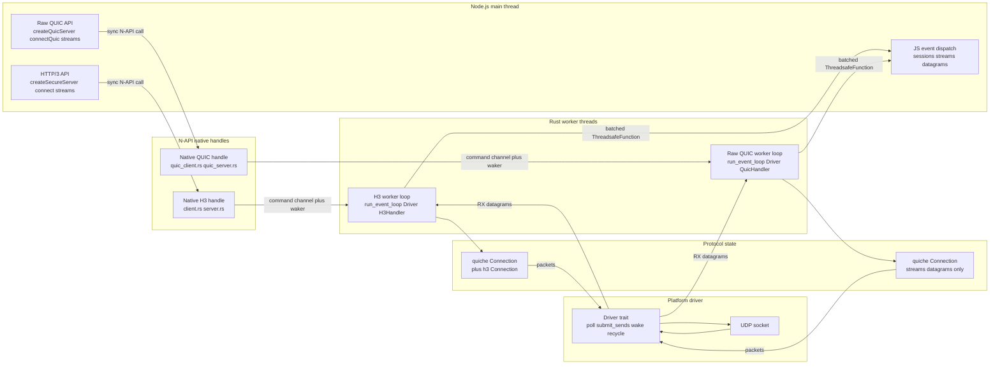
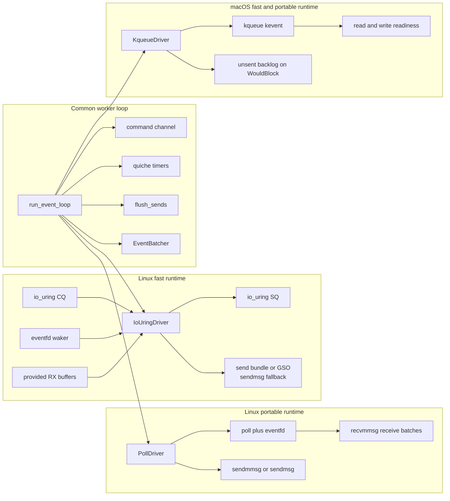
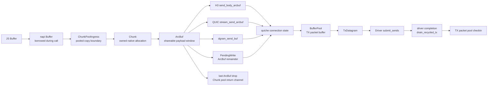
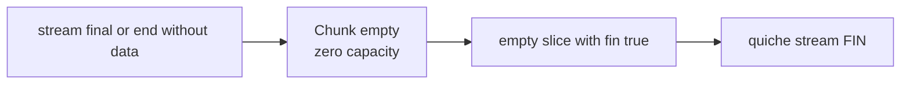
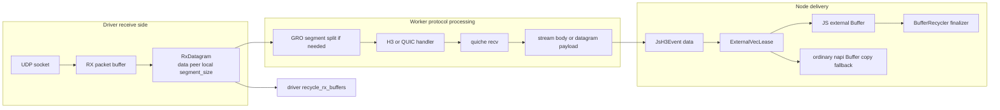

# Threading and Buffer Model

This document maps the current Node.js, native Rust, quiche, and platform
driver ownership model for HTTP/3 and raw QUIC. It is intentionally focused on
the implementation in this repository, not the public protocol specifications.

## Threading Model

The protocol layer is split into two implementations over the same worker loop:

- HTTP/3 uses quiche QUIC plus quiche h3 framing, headers, DATA, trailers, and
  request/response events.
- Raw QUIC uses quiche QUIC directly and exposes streams and datagrams without
  HTTP/3 framing.

Both paths use a Node.js thread for API calls, native handle objects for N-API
entry points, command channels into Rust worker threads, and a N-API
`ThreadsafeFunction` for event delivery back to JavaScript.

### Worker Ownership

Server workers own bound UDP sockets. Client workers may be dedicated or shared
depending on the runtime and topology policy.

```mermaid
flowchart TB
  subgraph H3Server["HTTP/3 server"]
    H3ServerJS["Server object"]
    H3ServerWorkers["1 or N server workers<br/>N when reuse_port sharding is active"]
    H3ServerSocket["Bound UDP socket per worker"]
    H3ServerSessions["Many H3 sessions per worker"]
    H3ServerJS --> H3ServerWorkers --> H3ServerSocket
    H3ServerWorkers --> H3ServerSessions
  end

  subgraph QUICServer["Raw QUIC server"]
    QUICServerJS["Server object"]
    QUICServerWorkers["1 or N server workers<br/>N when reuse_port sharding is active"]
    QUICServerSocket["Bound UDP socket per worker"]
    QUICServerSessions["Many QUIC sessions per worker"]
    QUICServerJS --> QUICServerWorkers --> QUICServerSocket
    QUICServerWorkers --> QUICServerSessions
  end

  subgraph H3Client["HTTP/3 client"]
    H3ClientJS["Client sessions"]
    H3ClientShared["Shared client worker<br/>one local UDP port per family"]
    H3ClientDedicated["Dedicated client worker<br/>used when topology requires it"]
    H3ClientJS --> H3ClientShared
    H3ClientJS --> H3ClientDedicated
  end

  subgraph QUICClient["Raw QUIC client"]
    QUICClientJS["Client sessions"]
    QUICClientShared["Shared client worker<br/>one local UDP port per family"]
    QUICClientDedicated["Dedicated client worker<br/>used when topology requires it"]
    QUICClientJS --> QUICClientShared
    QUICClientJS --> QUICClientDedicated
  end
```

### Platform Driver Differences

The worker loop has one semantic contract across platforms: block until packet,
waker, or deadline; process commands; process received datagrams; process timers;
flush quiche packets; recycle buffers. The driver implementation differs by
runtime and OS.

## Buffer Management

There are two different lifetime domains:

- Stream and datagram payload buffers move from JavaScript into Rust-owned
  chunks and then into quiche.
- UDP packet buffers are produced by quiche packetization, submitted to the
  platform driver, and recycled when the driver is done with them.

### Outbound Payloads And Packets

The only unavoidable outbound copy is the N-API boundary copy from a V8-owned
`Buffer` into Rust-owned memory. That copy lands in `ChunkPoolIngress` so the
allocation can be reused. After that point, pending stream writes retain
`ArcBuf` windows instead of flattening remainders into fresh vectors.

FIN-only writes are intentionally separate: they use `Chunk::empty()` and the
quiche empty-slice FIN path. They do not check out a pooled payload buffer and
they do not create an external payload lease.

### Inbound Packets And Events

Receive buffers are driver-owned until the worker loop has passed packet bytes
to the protocol handler. Event payload buffers are then converted to JavaScript
through `ExternalVecLease` when possible, with a copy fallback when the runtime
does not allow external buffers.

### Platform Buffer Details

The protocol and N-API buffer rules are shared across H3 and raw QUIC. The
driver-specific differences are below the `TxDatagram` and `RxDatagram`
boundary.

```mermaid
flowchart TB
  subgraph IoUringBuffers["Linux io_uring"]
    UringRX["provided RX buffer ring"]
    Bid["ProvidedBufferId<br/>validates ring index"]
    InitBuf["InitializedPacketBuf<br/>initialized packet storage"]
    UringRXDgram["RxDatagram"]
    UringTX["TxDatagram"]
    Bundle["send bundle or GSO slots"]
    CQE["CQE completion"]
    UringRecycle["return TX and RX buffers"]
    UringRX --> Bid --> InitBuf --> UringRXDgram
    UringTX --> Bundle --> CQE --> UringRecycle
  end

  subgraph PollBuffers["Linux poll"]
    PollRXPool["pooled RX buffers"]
    RecvBatch["recvmmsg batch"]
    PollRXDgram["RxDatagram"]
    PollTX["TxDatagram"]
    SendBatch["sendmmsg or sendmsg"]
    PollBacklog["unsent queue on WouldBlock"]
    PollRXPool --> RecvBatch --> PollRXDgram
    PollTX --> SendBatch --> PollBacklog
  end

  subgraph KqueueBuffers["macOS kqueue"]
    KqueueReady["kqueue readiness"]
    KqueueRecv["UDP recv loop"]
    KqueueRXDgram["RxDatagram"]
    KqueueTX["TxDatagram"]
    KqueueSend["UDP send"]
    KqueueBacklog["unsent backlog<br/>write wakeups"]
    KqueueReady --> KqueueRecv --> KqueueRXDgram
    KqueueTX --> KqueueSend --> KqueueBacklog
  end
```

## Differences To Keep Straight

| Area | HTTP/3 | Raw QUIC | Shared behavior |
| --- | --- | --- | --- |
| Protocol handler | `H3ServerHandler` and `H3ClientHandler` | `QuicServerHandler` and `QuicClientHandler` | Both implement `ProtocolHandler` for `run_event_loop`. |
| quiche layer | QUIC plus h3 connection | QUIC connection only | Both rely on quiche for congestion control, packetization, timers, streams, and datagrams. |
| JS surface | request, response, headers, body, trailers | streams and datagrams | Both use Node stream backpressure and native drain events for local admission. |
| Outbound stream payload | `send_body_arcbuf` | `stream_send_arcbuf` | Both use `ChunkPoolIngress`, `Chunk`, `ArcBuf`, and `PendingWrite`. |
| Datagrams | HTTP/3 DATAGRAM where enabled | QUIC DATAGRAM | Both use `dgram_send_buf` and receive event payload leasing. |
| Event delivery | HTTP/3 events | QUIC events | Both batch events through `ThreadsafeFunction<Vec<JsH3Event>>`. |

| Runtime | Driver | Threading and buffer implications |
| --- | --- | --- |
| Linux fast | `io_uring` | Completion based. Uses SQ/CQ, eventfd wakeups, provided buffer IDs for RX, and send bundle or GSO paths when available. |
| Linux portable | `poll` | Readiness based. Uses poll plus eventfd, receive and send batching, and an unsent queue for local backpressure from `WouldBlock`. |
| macOS fast | `kqueue` | Readiness based. Uses kqueue wakeups, UDP socket send and receive loops, and explicit unsent backlog tracking. |
| macOS portable | `kqueue` | Same backend as macOS fast, but selected and reported as portable runtime mode. |

## Invariants Worth Preserving

- JavaScript buffers are never retained past the N-API call unless the data has
  been copied or leased into Rust-owned memory.
- Pending stream writes retain `ArcBuf` windows, not flattened tail copies.
- A native write result or drain event means local admission/backlog progress,
  not far-end ACK.
- FIN-only writes have no payload lifetime and should stay on the empty-slice
  quiche FIN path.
- `InitializedPacketBuf`, `ProvidedBufferId`, and `ExternalVecLease` keep unsafe
  assumptions behind narrow safe APIs.
- Platform drivers may differ internally, but they must expose the same
  `RxDatagram`, `TxDatagram`, wake, poll, submit, and recycle semantics to the
  worker loop.
